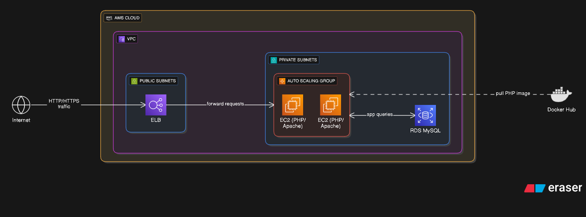

# LAMP Stack Deployment on AWS with Terraform



## Project Overview

This Terraform project automates the deployment of a highly available LAMP (Linux, Apache, MySQL, PHP) stack on AWS, following AWS Well-Architected Framework principles. The infrastructure is designed for scalability, availability, and security, with modular components that can be adapted for different use cases.

## Key Features

- **Highly Available Architecture**: Multi-AZ deployment for all critical components
- **Auto-scaling Web Tier**: Automatic scaling of web servers based on demand
- **Managed Database**: Amazon RDS MySQL with automated backups
- **Secure Configuration**: Network isolation and restricted access
- **Infrastructure as Code**: Reproducible deployments using Terraform
- **Monitoring**: Built-in CloudWatch alarms for key metrics

## Prerequisites

- AWS account with appropriate permissions
- Terraform v1.0+ installed
- AWS CLI configured
- SSH key pair for EC2 access

## Architecture Components

The solution consists of the following core components:

1. **Networking Layer**:
   - VPC with public and private subnets across multiple AZs
   - Internet Gateway and NAT Gateway for connectivity
   - Route tables for traffic management

2. **Compute Layer**:
   - Auto Scaling Group for web servers
   - Launch template with LAMP stack bootstrap
   - Application Load Balancer with health checks

3. **Data Layer**:
   - Amazon RDS MySQL instance
   - Automated backups and maintenance

4. **Security Layer**:
   - Security groups restricting traffic flow
   - IAM roles with least privilege

5. **Monitoring Layer**:
   - CloudWatch alarms for performance metrics
   - SNS notifications for critical events

## Deployment Instructions

### 1. Clone the Repository

```bash
git clone https://github.com/guderian120/lamp_stack_infranstructure
cd lamp_stack_infranstructure
```

### 2. Initialize Terraform

```bash
terraform init
```

### 3. Configure Variables

Create a `terraform.tfvars` file with your configuration:

```hcl
environment = "prod"
region = "us-east-1"
db_password = "your-secure-password"
ssh_ingress_cidr_blocks = ["203.0.113.0/24"] # Restrict to your IP
```

### 4. Review and Apply

```bash
terraform plan
terraform apply
```

### 5. Access the Application

After deployment completes, get the application URL:

```bash
terraform output -raw alb_dns_name
```

## Module Documentation

The infrastructure is organized into reusable Terraform modules:

| Module | Description | Key Features |
|--------|-------------|--------------|
| `vpc` | Networking foundation | VPC, subnets, gateways, route tables |
| `security_groups` | Network security | ALB, web, and database security groups |
| `database` | Managed MySQL database | RDS instance, backups, private placement |
| `auto_scaling` | Web server fleet | Launch template, scaling policies, self-healing |
| `load_balancer` | Traffic distribution | ALB, target groups, health checks |
| `monitoring` | Observability | CloudWatch alarms, SNS notifications |

## Maintenance Guide

### Scaling Operations

- **Vertical Scaling**: Adjust `instance_type` for RDS or EC2 instances
- **Horizontal Scaling**: Modify `min_size`, `max_size` in Auto Scaling Group

### Updates

1. **AMI Updates**:
   - Modify `ami_name_filter` in the auto scaling module
   - Create new launch template version

2. **Configuration Changes**:
   - Update user data scripts
   - Apply changes with `terraform apply`

### Backup and Recovery

- **Database Backups**: Managed by RDS with configurable retention
- **Infrastructure State**: Back up Terraform state files

### Destruction

To remove all resources:

```bash
terraform destroy
```

## Best Practices

1. **Security**:
   - Rotate database credentials regularly
   - Restrict SSH access to known IPs
   - Enable VPC flow logs for traffic monitoring

2. **Cost Optimization**:
   - Use appropriate instance types
   - Implement auto-scaling policies
   - Clean up unused resources

3. **Performance**:
   - Configure appropriate scaling thresholds
   - Enable RDS Performance Insights
   - Implement caching where applicable

## Troubleshooting

| Issue | Investigation Steps | Resolution |
|-------|----------------------|------------|
| Terraform Errors | Check the main.tf file, defualt profile is set to sandbox | comment out the sandbox profile |
| Web servers not registering with ALB | Check Auto Scaling Group events<br>Review target group health checks | Adjust health check settings<br>Verify security group rules |
| Database connection failures | Verify security group rules<br>Check RDS connectivity from EC2 | Update security groups<br>Verify credentials |
| Scaling not triggering | Review CloudWatch alarms<br>Check scaling policy metrics | Adjust scaling thresholds<br>Verify metric filters |
| Application errors | Check Apache error logs<br>Review PHP application logs | Update application code<br>Adjust PHP configuration |


## Support

For additional assistance:
- Refer to AWS documentation for LAMP stack best practices
- Check Terraform registry for module examples
- Review CloudWatch logs for detailed error information

## License

This project is licensed under the MIT License - see the [LICENSE](LICENSE) file for details.